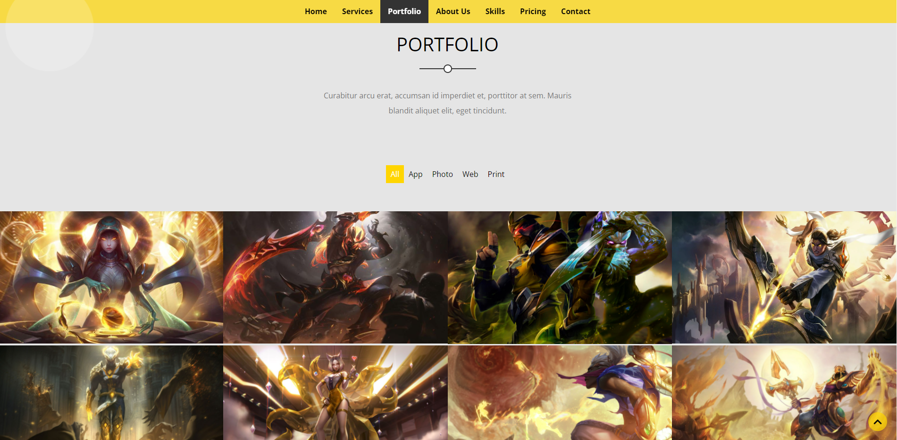

# FWD-First-Project-Landing-Page

This is a solution to the [First-Project task on FWD-UDACITY](https://egfwd.com/). 

## Table of contents

- [Overview](#overview)
  - [The Task(#the-Task)
  - [Screenshot](#screenshot)
  - [Links](#links)
- [My process](#my-process)
  - [Built with](#built-with)
  - [What I learned](#what-i-learned)
  - [Continued development](#continued-development)
  - [Useful resources](#useful-resources)
- [Author](#author)

## Overview

### The Task

Users should be able to:
- Ease of navigating between page sections, by fixed navigation bar
- View the optimal layout for the site depending on their device's screen size
- See hover states for all interactive elements on the page
- Go back to the top by pressing the up button
### Screenshot

### Links

- Live Site URL: [FWD-First-Project-Landing-Page](https://ahmedhll.github.io/FWD-First-Project-Landing-Page/)

## My process

### Built with

- Semantic HTML5 markup
- CSS custom properties
- Flexbox
- CSS Grid
- Mobile-first workflow
- JavaScript -ES6
### What I learned

The landing page presents the first opportunity to fully combine your skills in HTML, CSS, and JavaScript into a large project.
 Aside from solidifying your skills with these three technologies, you’ll discover how best to combine them in a complex application.

The following are just some of the questions that you’ll experience along the way:

- What’s the ideal workflow?
- How many files do I need?
- Do I modify the HTML first or the CSS?
- How many JavaScript functions do I need?
- Should my function be this many lines of code?
- Is readability or performance more important?

### Useful resources

- [webinar1](https://udacity.zoom.us/rec/play/qnQZJLcR9JDQO660FN7P_ltSZNjeDE2M13qxCyOI5z_mesgNPXaehunocDU-CCsPbu3DqjEWAVxWNT3b.brR5MFzW623aXAHv?continueMode=true&_x_zm_rtaid=fzAJpDm4TROp6BD3duEzsw.1638740725930.3a125f6599ee45130c0cb018c992a899&_x_zm_rhtaid=972).
- [webinar2](https://udacity.zoom.us/rec/play/u_zCHweC2Lya-u2bKEd0lJjGc5InsOXzJm_gIKXw_v3DM9unHJ13B_vyBY4lQ6qXjkNW9DUIfM-hakDu.obHqkCCpLpgWDfls?startTime=1642787885000&_x_zm_rtaid=OKPKLyEQToWT7TTnxTz8IQ.1643132826353.9dad08c0abf1e1d34dddf3ac04120f11&_x_zm_rhtaid=809).
- [slides](https://docs.google.com/presentation/d/162IuU4G3H3oD8-FLHbhhY5iMFrZzYxE3/edit#slide=id.p1).
- [FWD online community](https://nfpdiscussions.udacity.com/c/questions-hub/web-professional-questions-hub/85).
## Author

- web professional - [@AhmedHall](https://nfpdiscussions.udacity.com/u/ahmedhall/summary)